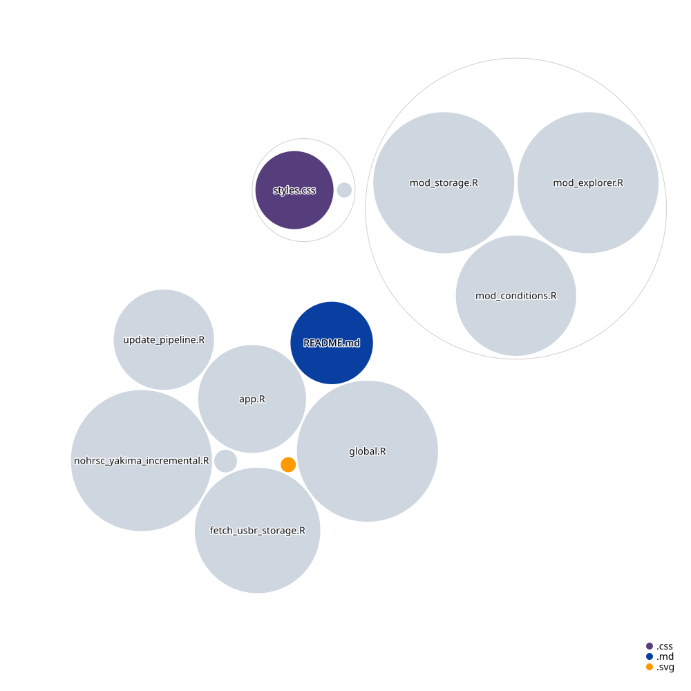

# Yakima Basin Water Dashboard
**Live app:** https://waterwater.shinyapps.io/yakima-storage

Combines USBR reservoir storage with NOHRSC/SNODAS snowpack (SWE) and NOAA NCEI
climate data to visualize water availability in the Yakima Basin, WA.

---

## File Structure



---

## First-time setup

### 1. Bootstrap data files
Run locally before first deployment:
```r
source("update_pipeline.R")
```
This takes ~30 seconds (USBR + NOHRSC + 24 NCEI calls). After it runs, the
`data/` folder will have all three CSVs and the app will start instantly.

### 2. Test locally
```r
shiny::runApp()
```

### 3. Set GitHub secrets
In your repo → Settings → Secrets and variables → Actions, add:

| Secret | Value |
|--------|-------|
| `SHINYAPPS_TOKEN` | Your shinyapps.io token |
| `SHINYAPPS_SECRET` | Your shinyapps.io secret |

Get these from: https://www.shinyapps.io → Account → Tokens

### 4. Add basin map image
Copy your placeholder image to `www/yakima_basin_map.png`.

### 5. Deploy
Either push to GitHub (Actions will auto-deploy after the first scheduled run),
or deploy manually:
```r
rsconnect::deployApp(appName = "yakima-storage", account = "waterwater")
```

---

## Data sources

| Data | Source | Update frequency |
|------|--------|-----------------|
| Dam storage | [USBR Hydromet](https://www.usbr.gov/pn-bin/daily.pl) | Daily |
| Snowpack SWE | [NOHRSC graph_only.php](https://www.nohrsc.noaa.gov/) | Daily |
| Climate | [NOAA NCEI Climate-at-a-Glance](https://www.ncei.noaa.gov/access/monitoring/) | Monthly |

---

## Data flow

```
GitHub Actions (05:42 UTC)
    └── update_pipeline.R
            ├── fetch_usbr_storage()   → data/yakima_dam_daily.csv
            ├── update_nohrsc_data()   → data/yakima_swe_combined.csv
            └── fetch_ncei_month()     → data/ncei_climate_monthly.csv
                    ↓
            git commit + push
                    ↓
            rsconnect::deployApp()
                    ↓
    global.R reads CSVs (fast, no API calls)
            ↓               ↓
    mod_storage.R    mod_explorer.R
```
### 4. Add basin map image

Copy your placeholder image to `www/yakima_basin_map.png`.

### 5. Deploy

Either push to GitHub (Actions will auto-deploy after the first scheduled run),
or deploy manually:

```r
rsconnect::deployApp(appName = "yakima-storage", account = "waterwater")
```

---

## Data sources

| Data | Source | Update frequency |
|------|--------|-----------------|
| Dam storage | [USBR Hydromet](https://www.usbr.gov/pn-bin/daily.pl) | Daily |
| Snowpack SWE | [NOHRSC graph_only.php](https://www.nohrsc.noaa.gov/) | Daily |
| Climate | [NOAA NCEI Climate-at-a-Glance](https://www.ncei.noaa.gov/access/monitoring/) | Monthly |

---

## Data flow

```
GitHub Actions (05:42 UTC)
    └── update_pipeline.R
            ├── fetch_usbr_storage()   → data/yakima_dam_daily.csv
            ├── update_nohrsc_data()   → data/yakima_swe_combined.csv
            └── fetch_ncei_month()     → data/ncei_climate_monthly.csv
                    ↓
            git commit + push
                    ↓
            rsconnect::deployApp()
                    ↓
    global.R reads CSVs (fast, no API calls)
            ↓               ↓               ↓
    mod_storage.R    mod_explorer.R    mod_conditions.R
```
